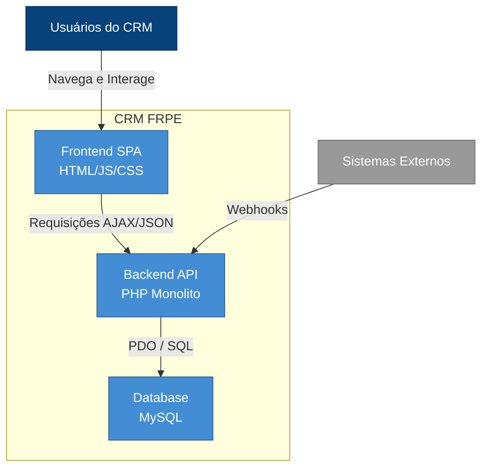

# C4 Model - Nível 2: Containers

```mermaid
graph TD
    classDef person fill:#08427b,stroke:#052e56,color:#fff;
    classDef container fill:#438dd5,stroke:#2e6295,color:#fff;
    classDef extSystem fill:#999999,stroke:#6b6b6b,color:#fff;

    V[Usuários do CRM]:::person
    
    subgraph CRM_System [CRM FRPE]
        SPA[Frontend SPA\nHTML/JS/CSS]:::container
        API[Backend API\nPHP Monolito]:::container
        DB[Database\nMySQL]:::container
    end
    
    WH[Sistemas Externos]:::extSystem

    V -->|Navega e Interage| SPA
    SPA -->|Requisições AJAX/JSON| API
    API -->|PDO / SQL| DB
    WH -->|Webhooks| API
```
