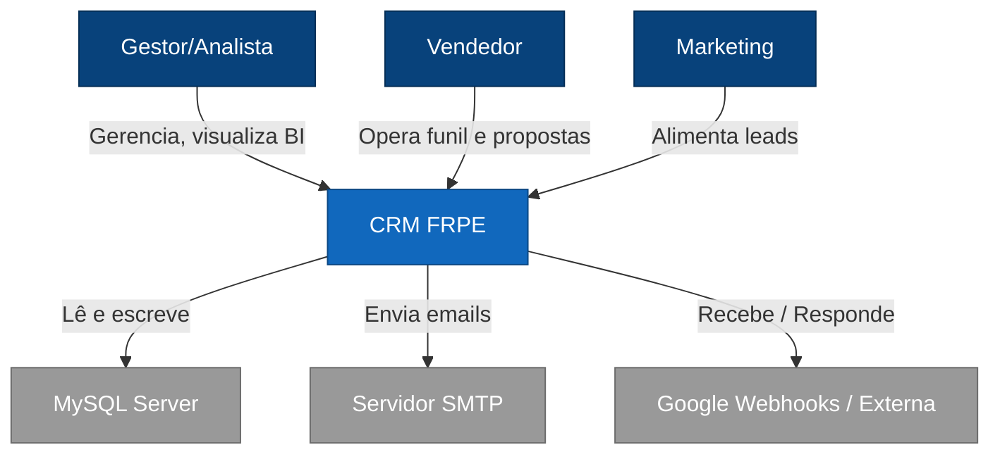

# C4 Model - Nível 1: Contexto

```mermaid
graph TD
    classDef person fill:#08427b,stroke:#052e56,color:#fff;
    classDef system fill:#1168bd,stroke:#0b4884,color:#fff;
    classDef extSystem fill:#999999,stroke:#6b6b6b,color:#fff;

    G[Gestor/Analista]:::person
    V[Vendedor]:::person
    M[Marketing]:::person
    
    CRM[CRM FRPE]:::system
    
    DB[MySQL Server]:::extSystem
    SMTP[Servidor SMTP]:::extSystem
    WH[Google Webhooks / Externa]:::extSystem

    G -->|Gerencia, visualiza BI| CRM
    V -->|Opera funil e propostas| CRM
    M -->|Alimenta leads| CRM
    
    CRM -->|Lê e escreve| DB
    CRM -->|Envia emails| SMTP
    CRM -->|Recebe / Responde| WH
```
