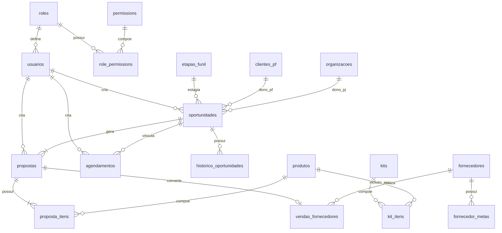

# Diagrama Entidade-Relacionamento Completo

```mermaid
erDiagram
    usuarios ||--o{ oportunidades : cria
    usuarios ||--o{ propostas : cria
    usuarios ||--o{ agendamentos : cria
    
    roles ||--o{ usuarios : define
    roles ||--o{ role_permissions : possui
    permissions ||--o{ role_permissions : compoe
    
    oportunidades ||--|{ propostas : gera
    oportunidades ||--o{ historico_oportunidades : possui
    oportunidades ||--o{ agendamentos : vincula
    etapas_funil ||--o{ oportunidades : estagia
    
    propostas ||--|{ proposta_itens : possui
    propostas ||--o| vendas_fornecedores : converte
    
    produtos ||--o{ proposta_itens : compoe
    kits ||--o{ kit_itens : compoe
    produtos ||--o{ kit_itens : incluso_em
    
    fornecedores ||--o{ fornecedor_metas : possui
    fornecedores ||--o{ vendas_fornecedores : realiza
    
    clientes_pf ||--o{ oportunidades : dono_pf
    organizacoes ||--o{ oportunidades : dono_pj
```
