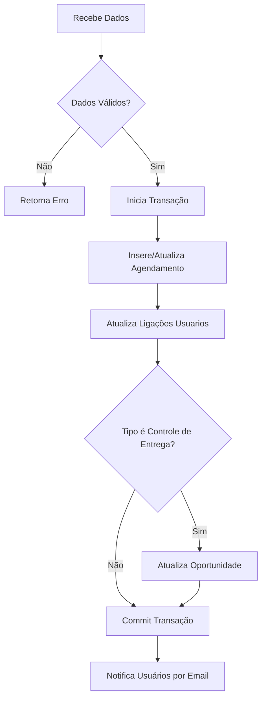

# Fluxograma — agenda

```mermaid
graph TD
    A[Recebe Dados] --> B{Dados Válidos?}
    B -- Não --> C[Retorna Erro]
    B -- Sim --> D[Inicia Transação]
    D --> E[Insere/Atualiza Agendamento]
    E --> F[Atualiza Ligações Usuarios]
    F --> G{Tipo é Controle de Entrega?}
    G -- Sim --> H[Atualiza Oportunidade]
    G -- Não --> I[Commit Transação]
    H --> I
    I --> J[Notifica Usuários por Email]
```
