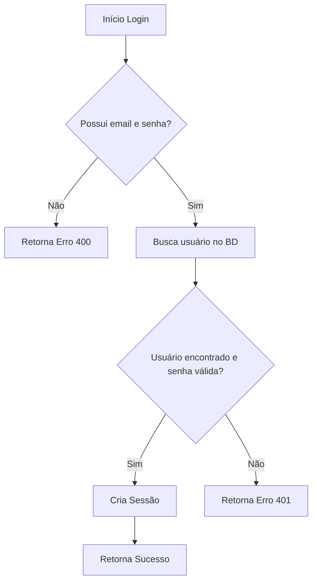

# Fluxograma — auth

```mermaid
graph TD
    A[Início Login] --> B{Possui email e senha?}
    B -- Não --> C[Retorna Erro 400]
    B -- Sim --> D[Busca usuário no BD]
    D --> E{Usuário encontrado e senha válida?}
    E -- Sim --> F[Cria Sessão]
    E -- Não --> G[Retorna Erro 401]
    F --> H[Retorna Sucesso]
```
