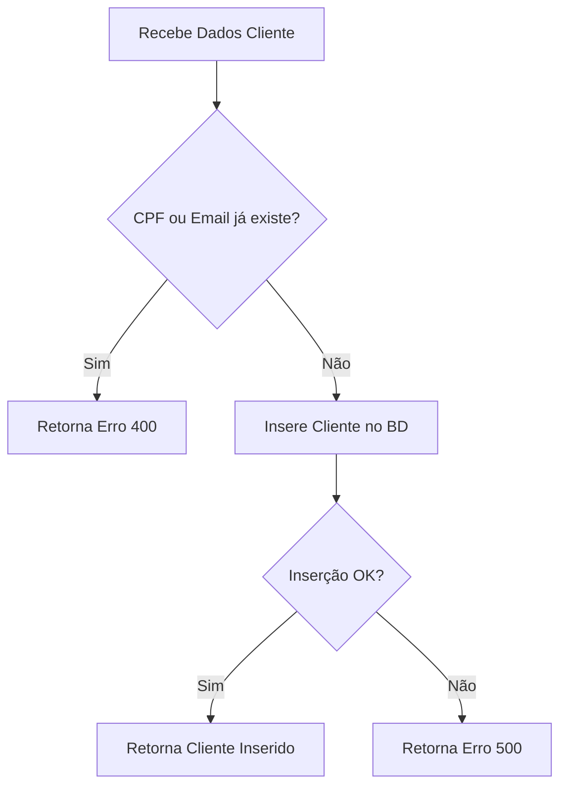

# Fluxograma — client_pf

```mermaid
graph TD
    A[Recebe Dados Cliente] --> B{CPF ou Email já existe?}
    B -- Sim --> C[Retorna Erro 400]
    B -- Não --> D[Insere Cliente no BD]
    D --> E{Inserção OK?}
    E -- Sim --> F[Retorna Cliente Inserido]
    E -- Não --> G[Retorna Erro 500]
```
