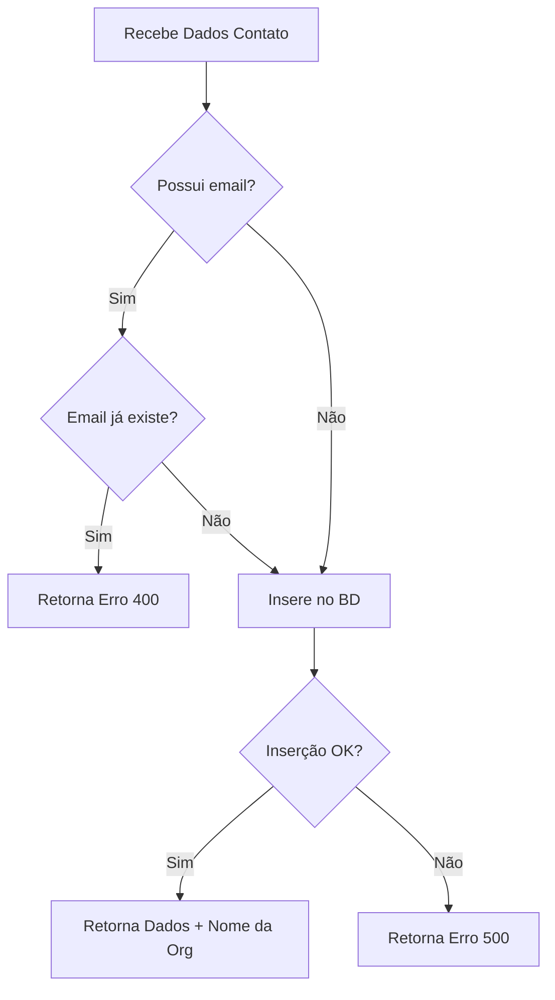

# Fluxograma — contact

```mermaid
graph TD
    A[Recebe Dados Contato] --> B{Possui email?}
    B -- Sim --> C{Email já existe?}
    C -- Sim --> D[Retorna Erro 400]
    C -- Não --> E[Insere no BD]
    B -- Não --> E
    E --> F{Inserção OK?}
    F -- Sim --> G[Retorna Dados + Nome da Org]
    F -- Não --> H[Retorna Erro 500]
```
