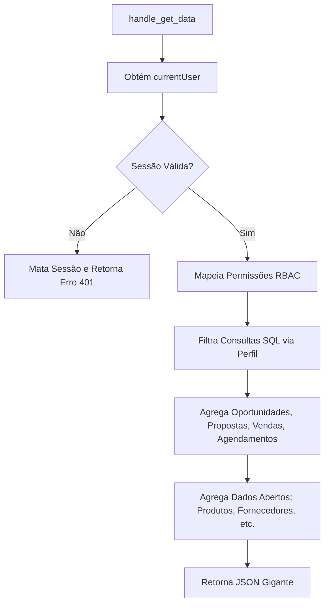

# Fluxograma — data

```mermaid
graph TD
    A[handle_get_data] --> B[Obtém currentUser]
    B --> C{Sessão Válida?}
    C -- Não --> D[Mata Sessão e Retorna Erro 401]
    C -- Sim --> E[Mapeia Permissões RBAC]
    E --> F[Filtra Consultas SQL via Perfil]
    F --> G[Agrega Oportunidades, Propostas, Vendas, Agendamentos]
    G --> H[Agrega Dados Abertos: Produtos, Fornecedores, etc.]
    H --> I[Retorna JSON Gigante]
```
