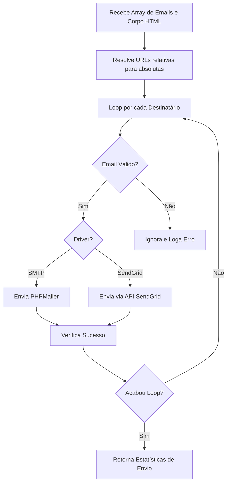

# Fluxograma — email

```mermaid
graph TD
    A[Recebe Array de Emails e Corpo HTML] --> B[Resolve URLs relativas para absolutas]
    B --> C[Loop por cada Destinatário]
    C --> D{Email Válido?}
    D -- Sim --> E{Driver?}
    E -- SMTP --> F[Envia PHPMailer]
    E -- SendGrid --> G[Envia via API SendGrid]
    F --> H[Verifica Sucesso]
    G --> H
    D -- Não --> I[Ignora e Loga Erro]
    H --> J{Acabou Loop?}
    J -- Não --> C
    J -- Sim --> K[Retorna Estatísticas de Envio]
```
