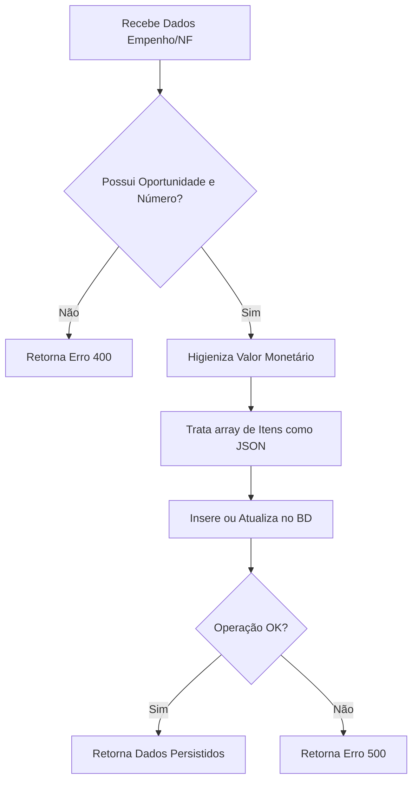

# Fluxograma — finance

```mermaid
graph TD
    A[Recebe Dados Empenho/NF] --> B{Possui Oportunidade e Número?}
    B -- Não --> C[Retorna Erro 400]
    B -- Sim --> D[Higieniza Valor Monetário]
    D --> E[Trata array de Itens como JSON]
    E --> F[Insere ou Atualiza no BD]
    F --> G{Operação OK?}
    G -- Sim --> H[Retorna Dados Persistidos]
    G -- Não --> I[Retorna Erro 500]
```
