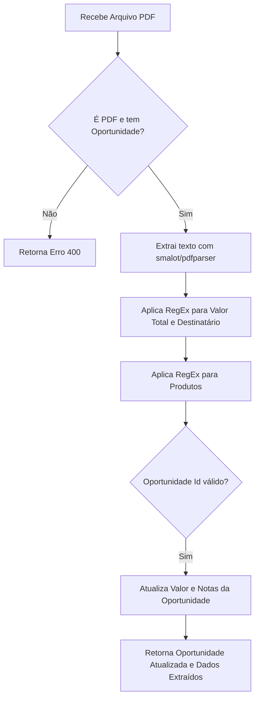

# Fluxograma — invoice_parser

```mermaid
graph TD
    A[Recebe Arquivo PDF] --> B{É PDF e tem Oportunidade?}
    B -- Não --> C[Retorna Erro 400]
    B -- Sim --> D[Extrai texto com smalot/pdfparser]
    D --> E[Aplica RegEx para Valor Total e Destinatário]
    E --> F[Aplica RegEx para Produtos]
    F --> G{Oportunidade Id válido?}
    G -- Sim --> H[Atualiza Valor e Notas da Oportunidade]
    H --> I[Retorna Oportunidade Atualizada e Dados Extraídos]
```
