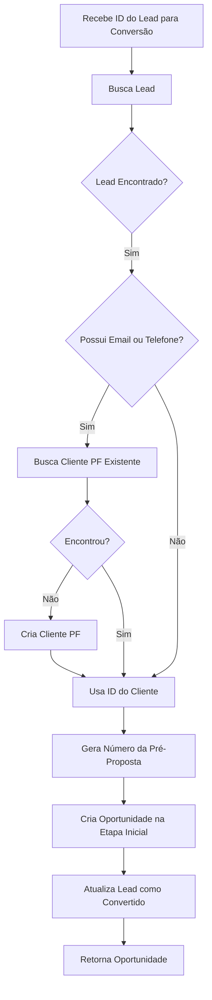

# Fluxograma — lead

```mermaid
graph TD
    A[Recebe ID do Lead para Conversão] --> B[Busca Lead]
    B --> C{Lead Encontrado?}
    C -- Sim --> D{Possui Email ou Telefone?}
    D -- Sim --> E[Busca Cliente PF Existente]
    E --> F{Encontrou?}
    F -- Não --> G[Cria Cliente PF]
    F -- Sim --> H[Usa ID do Cliente]
    D -- Não --> H
    G --> H
    H --> I[Gera Número da Pré-Proposta]
    I --> J[Cria Oportunidade na Etapa Inicial]
    J --> K[Atualiza Lead como Convertido]
    K --> L[Retorna Oportunidade]
```
