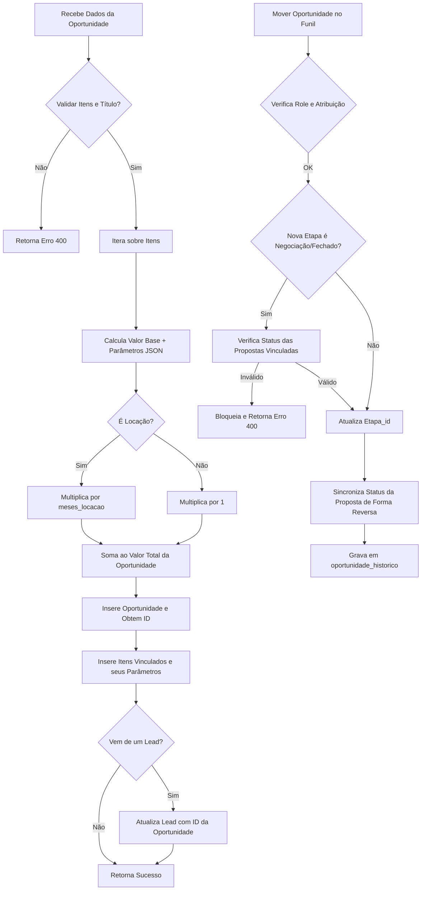

# Fluxograma — opportunity

```mermaid
graph TD
    A[Recebe Dados da Oportunidade] --> B{Validar Itens e Título?}
    B -- Não --> C[Retorna Erro 400]
    B -- Sim --> D[Itera sobre Itens]
    D --> E[Calcula Valor Base + Parâmetros JSON]
    E --> F{É Locação?}
    F -- Sim --> G[Multiplica por meses_locacao]
    F -- Não --> H[Multiplica por 1]
    G --> I[Soma ao Valor Total da Oportunidade]
    H --> I
    I --> J[Insere Oportunidade e Obtem ID]
    J --> K[Insere Itens Vinculados e seus Parâmetros]
    K --> L{Vem de um Lead?}
    L -- Sim --> M[Atualiza Lead com ID da Oportunidade]
    L -- Não --> N[Retorna Sucesso]
    M --> N
    
    O[Mover Oportunidade no Funil] --> P{Verifica Role e Atribuição}
    P -- OK --> Q{Nova Etapa é Negociação/Fechado?}
    Q -- Sim --> R[Verifica Status das Propostas Vinculadas]
    R -- Inválido --> S[Bloqueia e Retorna Erro 400]
    R -- Válido --> T[Atualiza Etapa_id]
    Q -- Não --> T
    T --> U[Sincroniza Status da Proposta de Forma Reversa]
    U --> V[Grava em oportunidade_historico]
```
