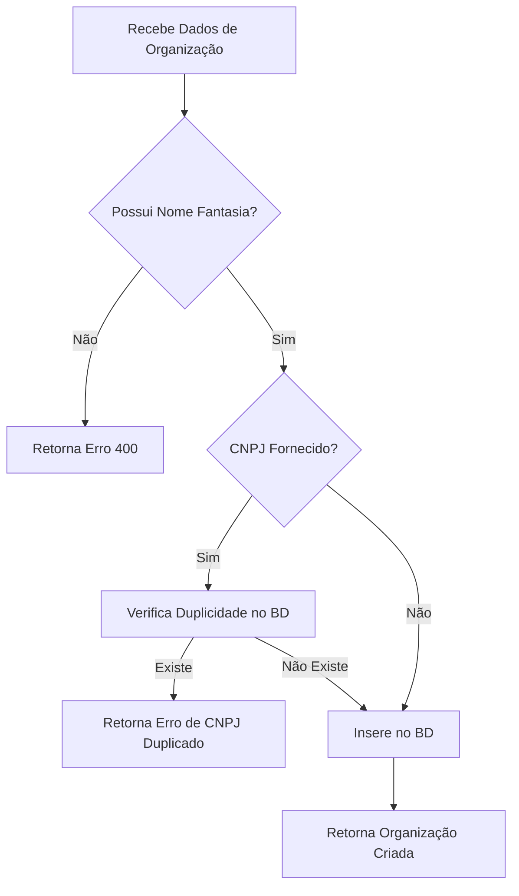

# Fluxograma — organization

```mermaid
graph TD
    A[Recebe Dados de Organização] --> B{Possui Nome Fantasia?}
    B -- Não --> C[Retorna Erro 400]
    B -- Sim --> D{CNPJ Fornecido?}
    D -- Sim --> E[Verifica Duplicidade no BD]
    E -- Existe --> F[Retorna Erro de CNPJ Duplicado]
    E -- Não Existe --> G[Insere no BD]
    D -- Não --> G
    G --> H[Retorna Organização Criada]
```
