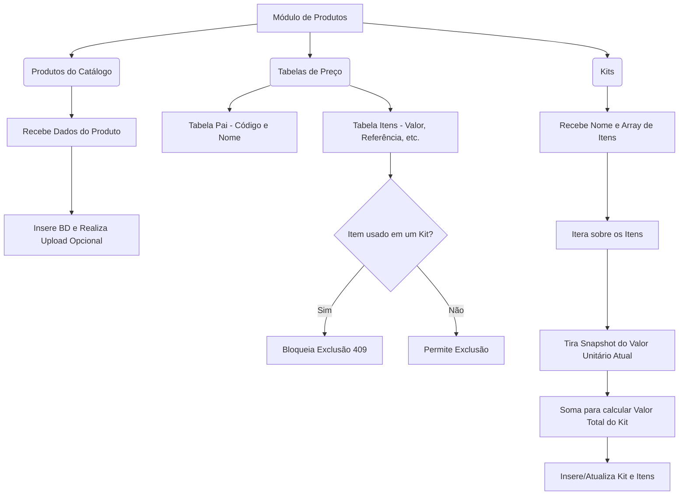

# Fluxograma — product

```mermaid
graph TD
    A[Módulo de Produtos] --> B(Produtos do Catálogo)
    A --> C(Tabelas de Preço)
    A --> D(Kits)
    
    B --> B1[Recebe Dados do Produto]
    B1 --> B2[Insere BD e Realiza Upload Opcional]
    
    C --> C1[Tabela Pai - Código e Nome]
    C --> C2[Tabela Itens - Valor, Referência, etc.]
    C2 --> C3{Item usado em um Kit?}
    C3 -- Sim --> C4[Bloqueia Exclusão 409]
    C3 -- Não --> C5[Permite Exclusão]
    
    D --> D1[Recebe Nome e Array de Itens]
    D1 --> D2[Itera sobre os Itens]
    D2 --> D3[Tira Snapshot do Valor Unitário Atual]
    D3 --> D4[Soma para calcular Valor Total do Kit]
    D4 --> D5[Insere/Atualiza Kit e Itens]
```
