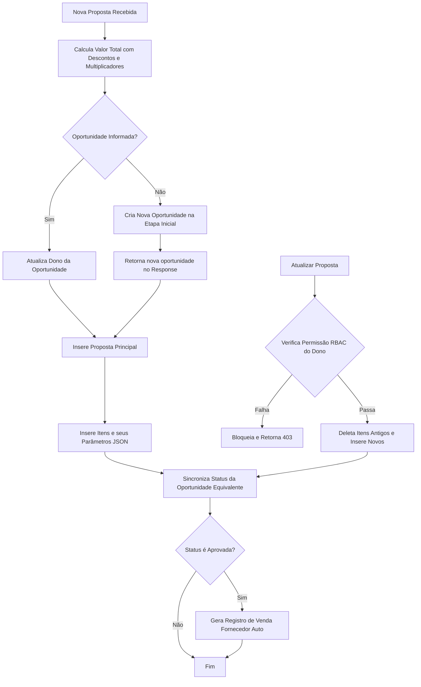

# Fluxograma — proposal

```mermaid
graph TD
    A[Nova Proposta Recebida] --> B[Calcula Valor Total com Descontos e Multiplicadores]
    B --> C{Oportunidade Informada?}
    C -- Sim --> D[Atualiza Dono da Oportunidade]
    C -- Não --> E[Cria Nova Oportunidade na Etapa Inicial]
    E --> F[Retorna nova oportunidade no Response]
    D --> G[Insere Proposta Principal]
    F --> G
    G --> H[Insere Itens e seus Parâmetros JSON]
    H --> I[Sincroniza Status da Oportunidade Equivalente]
    I --> J{Status é Aprovada?}
    J -- Sim --> K[Gera Registro de Venda Fornecedor Auto]
    J -- Não --> L[Fim]
    K --> L
    
    M[Atualizar Proposta] --> N{Verifica Permissão RBAC do Dono}
    N -- Falha --> O[Bloqueia e Retorna 403]
    N -- Passa --> P[Deleta Itens Antigos e Insere Novos]
    P --> I
```
