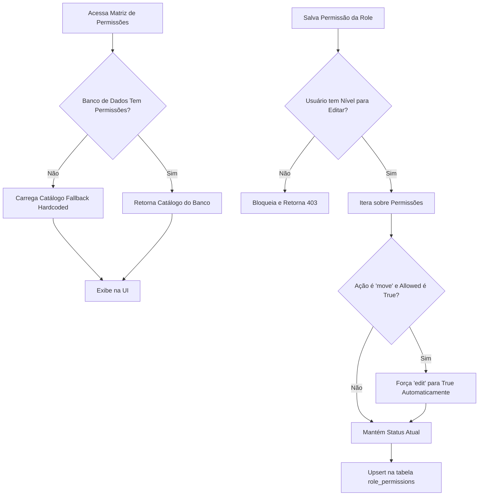

# Fluxograma — rbac

```mermaid
graph TD
    A[Acessa Matriz de Permissões] --> B{Banco de Dados Tem Permissões?}
    B -- Não --> C[Carrega Catálogo Fallback Hardcoded]
    B -- Sim --> D[Retorna Catálogo do Banco]
    C --> E[Exibe na UI]
    D --> E
    
    F[Salva Permissão da Role] --> G{Usuário tem Nível para Editar?}
    G -- Não --> H[Bloqueia e Retorna 403]
    G -- Sim --> I[Itera sobre Permissões]
    I --> J{Ação é 'move' e Allowed é True?}
    J -- Sim --> K[Força 'edit' para True Automaticamente]
    J -- Não --> L[Mantém Status Atual]
    K --> L
    L --> M[Upsert na tabela role_permissions]
```
