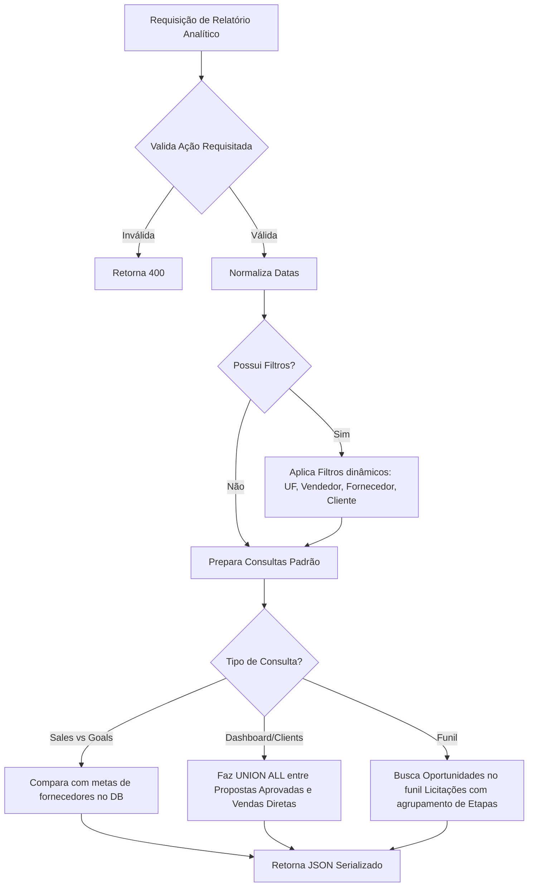

# Fluxograma — report

```mermaid
graph TD
    A[Requisição de Relatório Analítico] --> B{Valida Ação Requisitada}
    B -- Inválida --> C[Retorna 400]
    B -- Válida --> D[Normaliza Datas]
    D --> E{Possui Filtros?}
    E -- Sim --> F[Aplica Filtros dinâmicos: UF, Vendedor, Fornecedor, Cliente]
    E -- Não --> G[Prepara Consultas Padrão]
    F --> G
    G --> H{Tipo de Consulta?}
    H -- "Sales vs Goals" --> I[Compara com metas de fornecedores no DB]
    H -- "Dashboard/Clients" --> J[Faz UNION ALL entre Propostas Aprovadas e Vendas Diretas]
    H -- "Funil" --> K[Busca Oportunidades no funil Licitações com agrupamento de Etapas]
    I --> L[Retorna JSON Serializado]
    J --> L
    K --> L
```
