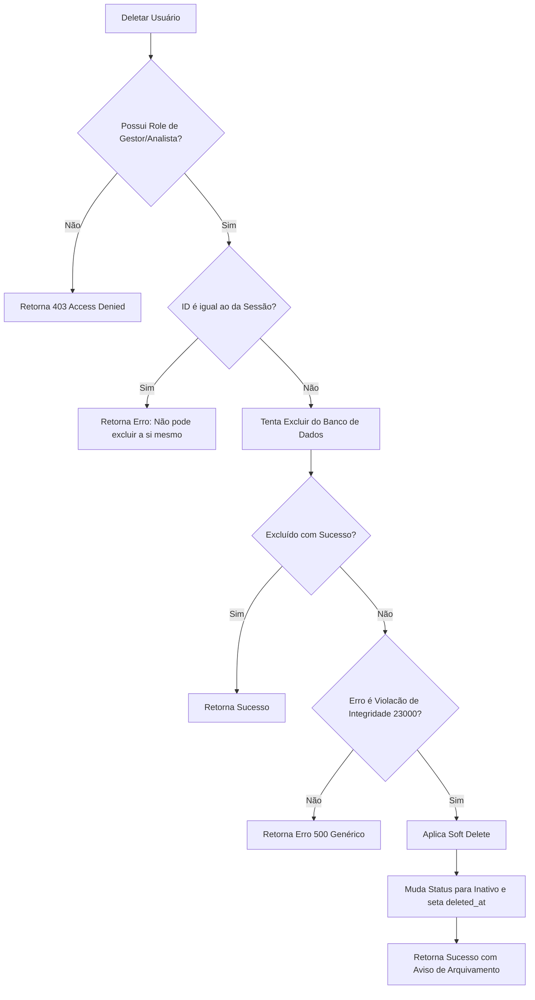

# Fluxograma — user

```mermaid
graph TD
    A[Deletar Usuário] --> B{Possui Role de Gestor/Analista?}
    B -- Não --> C[Retorna 403 Access Denied]
    B -- Sim --> D{ID é igual ao da Sessão?}
    D -- Sim --> E[Retorna Erro: Não pode excluir a si mesmo]
    D -- Não --> F[Tenta Excluir do Banco de Dados]
    F --> G{Excluído com Sucesso?}
    G -- Sim --> H[Retorna Sucesso]
    G -- Não --> I{Erro é Violacão de Integridade 23000?}
    I -- Não --> J[Retorna Erro 500 Genérico]
    I -- Sim --> K[Aplica Soft Delete]
    K --> L[Muda Status para Inativo e seta deleted_at]
    L --> M[Retorna Sucesso com Aviso de Arquivamento]
```
