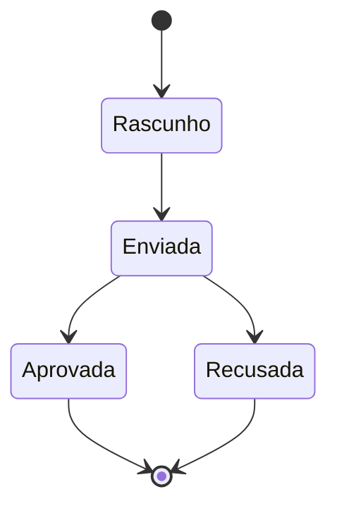
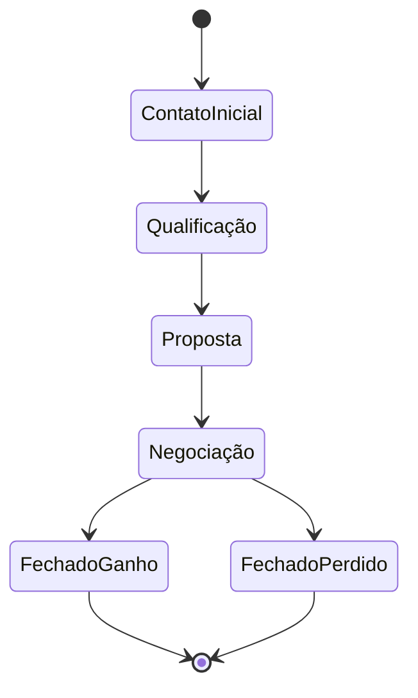

# Máquinas de Estado

## Propostas (status)

*Gatilhos observados:*
- Ao atingir `Aprovada`, gera venda em `vendas_fornecedores`.
- Sincroniza retroativamente a Oportunidade correspondente.

## Oportunidades (funil)

*(Nota: As etapas exatas podem ser customizadas no banco via `etapas_funil`, mas seguem essa progressão lógica)*
